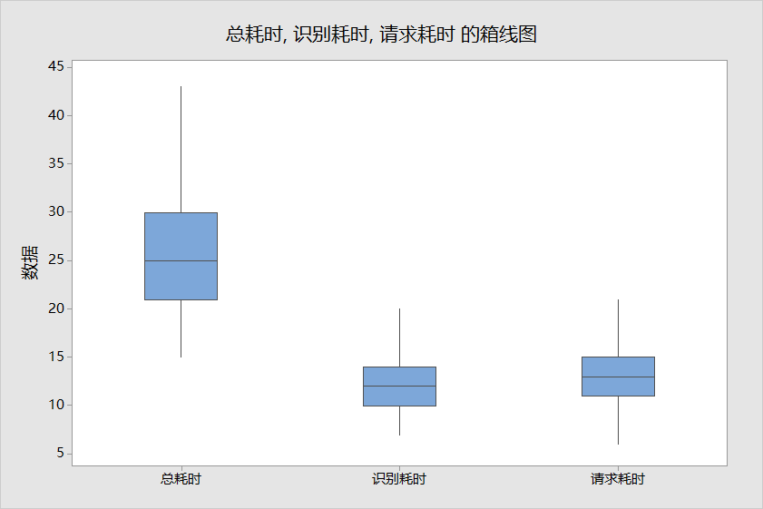
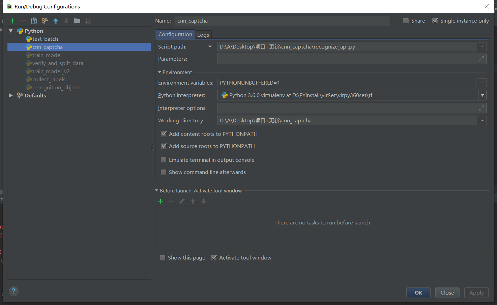

# cnn_captcha
use CNN recognize captcha by tensorflow.
This project uses tensorflow to realize the convolutional neural network for the character image verification code to recognize the verification code.
The project encapsulates the more general **checkout, training, verification, recognition, and API modules**, which greatly reduces the time and effort required to identify character verification codes.

The project has helped many students to efficiently complete the verification code identification task.
If you have a bug and make good improvements during use, you are welcome to submit an issue and PR. The author will reply as soon as possible, hoping to improve the project with you.

If you need to identify click, drag and drop verification codes, or have target detection requirements, you can also refer to this project [nickliqian/darknet_captcha](https://github.com/nickliqian/darknet_captcha).

# Schedule
#### 2018.11.12
First edition Readme.md
#### 2018.11.21
Add some instructions about verification code recognition
#### 2018.11.24
Optimize the rules for verifying data set pictures
#### 2018.11.26
Added `train_model_v2.py` file to output the accuracy of training set and validation set simultaneously during training
#### 2018.12.06
Added support for model deployment and fixed several bugs
#### 2018.12.08
Optimize model recognition speed, support api stress test and statistics time-consuming
#### 2019.02.19
1. Added a new accuracy calculation method
2. TAG: v1.0
#### 2019.04.12
1. Keep only one `train_model.py` file
2. Optimize code structure
3. Extract the general configuration to `sample_config.json` and `captcha_config.json`
4. Fix some issues raised by everyone in the issue
#### 2019.06.01
1. Improve the readme document, the document is not long, please be sure to read it~
2. Use the cnnlib directory to store the neural network structure code
3. Made a version of training data statistics, you can refer to our training times, duration and accuracy
4. TAG: v2.0

# table of Contents
<a href="#Project Introduction">1 Project Introduction</a>
-<a href="#About verification code recognition">1.1 About verification code recognition</a>
-<a href="#directory structure">1.2 directory structure</a>
-<a href="#dependency">1.3 Dependency</a>
-<a href="#Model structure">1.4 Model structure</a>

<a href="#How to use">2 How to use</a>
-<a href="#Data Set">2.1 Data Set</a>
-<a href="#Configuration File">2.2 Configuration File</a>
-<a href="#Verify and split the data set">2.3 Verify and split the data set</a>
-<a href="#training model">2.4 training model</a>
-<a href="#Batch verification">2.5 Batch verification</a>
-<a href="#Start WebServer">2.6 Start WebServer</a>
-<a href="#Call interface identification">2.7 Call interface identification</a>
-<a href="#Deploy">2.8 Deployment</a>
-<a href="#Deploy multiple models">2.9 Deploy multiple models</a>
-<a href="#online identification">2.10 online identification</a>

<a href="#Description">3 Statistics</a>
-<a href="#Training data statistics">3.1 Training data statistics</a>
-<a href="#stress test">3.2 stress test</a>

<a href="#Development Instructions">4 Development Instructions</a>

<a href="#Known BUG">5 Known BUG</a>


# 1 Project Introduction
## 1.1 About verification code recognition
Verification code recognition is mostly a problem that crawlers will encounter, and it can also be used as an introductory case for image recognition. Currently, the following methods are commonly used:

| Method name | Related points |
| ------ | ------ |
| tesseract | Only suitable for recognizing pictures without interference and distortion, it is very troublesome to train |
| Other open source recognition libraries | Not general enough, recognition rate unknown |
| Paid OCR API | High-demand scenarios, high costs |
| Image processing + machine learning classification algorithm | Involves a variety of technologies, high learning costs, and not universal |
| Convolutional Neural Network | A certain learning cost, the algorithm is suitable for multiple types of verification codes |

Here we talk about the use of traditional **image processing and machine learning algorithms**, involving multiple technologies:

1. Image processing
-Pre-processing (grayscale, binarization)
- Image segmentation
-Crop (remove border)
-Image filtering, noise reduction
-Go to background
-Color separation
-Rotation
2. Machine Learning
-KNN
-SVM

The use of this type of method has higher requirements for users, and because of the many types of changes in the picture, the processing method is not universal enough, and it often takes a lot of time to adjust the processing steps and related algorithms.
Using **Convolutional Neural Network**, you can achieve end-to-end recognition of most static character verification codes through simple pre-processing, with very good results and high versatility.

Here is a list of the current **common verification code** generation libraries:
>Reference: [Java Verification Family Bucket](https://www.cnblogs.com/cynchanpin/p/6912301.html)

| Language | Verification Code Library Name | Link | Sample |
| ------ | ------ | ------ | ------ |
| Java | JCaptcha | [Example](https://jcaptcha.atlassian.net/wiki/spaces/general/pages/1212427/Samples+tests) |    |
| Java | JCaptcha4Struts2 | | |
| Java | SimpleCaptcha | [Example](https://www.oschina.net/p/simplecaptcha) | ! [Effect 2](./readme_image/SimpleCaptcha_2. jpg)  |
| Java | kaptcha | [Example](https://github.com/linghushaoxia/kaptcha) |    |
| Java | patchca | |! [Effect 1](./readme_image/patchca_1.png) |
| Java | imageRandom | | |
| Java | iCaptcha | |! [Effect 1](./readme_image/iCaptcha.jpg) |
| Java | SkewPassImage | |  |
| Java | Cage | |   |
| Python | captcha | [Example](https://github.com/nickliqian/cnn_captcha/blob/master/gen_image/gen_sample_by_captcha.py) |  |
| Python | pycapt | [Example](https://github.com/aboutmydreams/pycapt) |  |
| PHP | Gregwar/Captcha | [Document](https://github.com/Gregwar/Captcha) | |
| PHP | mewebstudio/captcha | [Document](https://github.com/mewebstudio/captcha) | |

## 1.2 Directory structure
### 1.2.1 Basic configuration
| Serial number | File name | Description |
| ------ | ------ | ------ |
| 1 | `conf/` | Configuration file directory |
| 2 | `sample/` | Data set directory |
| 3 | `model/` | Model file directory |
| 4 | `cnnlib/` | Package CNN related code directory |
### 1.2.2 Training model
| Serial number | File name | Description |
| ------ | ------ | ------ |
| 1 | verify_and_split_data.py | Verify data set, split data into training set and test set |
| 2 | network.py | cnn network base class |
| 3 | train_model.py | Training model |
| 4 | test_batch.py​​ | Batch verification |
| 5 | gen_image/gen_sample_by_captcha.py | Script to generate captcha |
| 6 | gen_image/collect_labels.py | Used to count verification code labels (usually used for Chinese verification codes) |

### 1.2.3 web interface
| Serial number | File name | Description |
| ------ | ------ | ------ |
| 1 | webserver_captcha_image.py | Get captcha interface |
| 2 | webserver_recognize_api.py | Provide online identification verification code interface |
| 3 | recognize_online.py | Example of using interface recognition |
| 4 | recognize_local.py | Examples of testing local images |
| 5 | recognize_time_test.py | Stress test recognition time-consuming and request response time-consuming |

## 1.3 Dependency
```
pip install -r requirements.txt
```
Note: If you need to use GPU for training, please modify tenforflow in the file to tensorflow-gpu

## 1.4 Model structure

| Serial Number | Level |
| :------: | :------: |
| Input | input |
| 1 | Convolutional layer + Pooling layer + Downsampling layer + ReLU |
| 2 | Convolutional layer + Pooling layer + Downsampling layer + ReLU |
| 3 | Convolutional layer + Pooling layer + Downsampling layer + ReLU |
| 4 | Fully connected + downsampling layer + Relu |
| 5 | Fully connected + softmax |
| Output | output |

# 2 How to use
## 2.1 Data set
The original data set can be stored in the `./sample/origin` directory.
For ease of processing, the picture is best named in the format `2e8j_17322d3d4226f0b5c5a71d797d2ba7f7.jpg` (label_serial number. suffix).

If you don't have a training set, you can use the `gen_sample_by_captcha.py` file to generate a training set file.
Before generating, you need to modify the related configuration `conf/captcha_config.json` (path, file suffix, character set, etc.).
```
{
  "root_dir": "sample/origin/", # Verification code save path
  "image_suffix": "png", # Verification code image suffix
  "characters": "0123456789", # Optional characters to generate verification code
  "count": 1000, # The number of pictures to generate verification code
  "char_count": 4, # The number of characters on each verification code picture
  "width": 100, # Picture width
  "height": 60 # Picture height
}
```

## 2.2 Configuration file
Before creating a new project, you need to **modify the relevant configuration file **`conf/sample_config.json`.
```
{
  "origin_image_dir": "sample/origin/", # original file
  "new_image_dir": "sample/new_train/", # New training sample
  "train_image_dir": "sample/train/", # training set
  "test_image_dir": "sample/test/", # test set
  "api_image_dir": "sample/api/", # Storage path of the image received by api
  "online_image_dir": "sample/online/", # The storage path of the image obtained from the verification code url
  "local_image_dir": "sample/local/", # Path to save the image locally
  "model_save_dir": "model/", # The storage path of the image obtained from the verification code url
  "image_width": 100, # image width
  "image_height": 60, # image height
  "max_captcha": 4, # Number of characters in the verification code
  "image_suffix": "png", # Picture file suffix
  "char_set": "0123456789abcdefghijklmnopqrstuvwxyz", # Verification code recognition result category
  "use_labels_json_file": false, # Whether to enable reading `labels.json` content
  "remote_url": "http://127.0.0.1:6100/captcha/", # verification code to obtain the address remotely
  "cycle_stop": 3000, # After starting the task, the training stops after a specified number of times
  "acc_stop": 0.99, # Stop after training to the specified accuracy
  "cycle_save": 500, # Save the model regularly after training for a specified number of times
  "enable_gpu": 0, # Whether to enable GUP training
  "train_batch_size": 128, # The number of pictures used each time during training. If the CPU or GPU memory is too small, you can reduce this parameter
  "test_batch_size": 100 # The number of pictures to be verified in each batch of tests should not exceed the total number of verification code sets
}

```
Regarding the `Verification code recognition result category`, assuming your sample is a Chinese verification code, you can use the `tools/collect_labels.py` script to perform label statistics.
The file `gen_image/labels.json` will be generated to store all the labels. Set `use_labels_json_file = True` in the configuration file to enable reading the content of `labels.json` as the `result category`.

## 2.3 Validate and split the data set
This function will verify the size of the original picture set and whether the test picture can be opened, and split the training set and test set at a ratio of 19:1.
So you need to create and specify three folders: origin, train, and test to store related files.

You can also modify it to a different directory, but it is best to modify it to an absolute path.
After the folder is created, execute the following command:
```
python3 verify_and_split_data.py
```
Generally there will be a prompt similar to the following
```
>>> Start verification directory: [sample/origin/]
Start to verify the original picture collection
Total pictures in the original set: 1001
====The following 1 picture is abnormal====
[Picture 0] [.DStore] [File extension is incorrect]
========end
Start to separate the original image set: test set (5%) and training set (95%)
A total of 1000 images are allocated to the training set and test set, one of which is an anomaly and remains in the original directory
The number of test sets is: 50
The number of training sets is: 950
>>> Start to verify the catalog: [sample/new_train/]
[Warning] The directory sample/new_train/ cannot be found, it will be created soon
Start to verify the original picture collection
The original set of total pictures: 0
====The following 0 pictures are abnormal====
No abnormality found (0 pictures in total)
========end
Start to separate the original image set: test set (5%) and training set (95%)
A total of 0 pictures are allocated to the training set and test set, of which 0 pictures are left in the original directory as anomalies
The number of test sets is: 0
The number of training sets is: 0
```
The program will check and split the images in the two directories `origin_image_dir` and `new_image_dir` at the same time; there will be more samples later, you can put the samples in the `new_image_dir` directory and execute `verify_and_split_data` again.
The program will leave invalid files in the original folder.

In addition, when you have new samples that need to be trained together, you can put them in the `sample/new` directory and run `python3 verify_and_split_data.py` again.
It should be noted that if there are new labels in the new sample, you need to add the new labels to the `char_set` configuration or the `labels.json` file.

## 2.4 Training model
After creating the training set and test set, you can start training the model.
During training, a log will be output, which shows the current number of training rounds, accuracy and loss.
**The accuracy rate at this time is the accuracy rate of the training set image, which represents the image recognition situation of the training set**
E.g:
```
10th training >>>
[Training set] The character accuracy rate is 0.03000 The picture accuracy rate is 0.00000 >>> loss 0.1698757857
[Verification set] The character accuracy rate is 0.04000 The picture accuracy rate is 0.00000 >>> loss 0.1698757857
```
Explanation of character accuracy and picture accuracy:
```
Assumption: There are 100 pictures, each picture has four characters, a total of 400 characters. Here we split the task into 400 characters that need to be recognized
Character accuracy: The percentage of correct characters among the 400 characters recognized.
Picture accuracy: Among 100 pictures, the proportion of pictures with 4 characters fully recognized accurately.
```
I will not specifically introduce tensorflow installation related issues here, and go straight to the topic.
After ensuring that the picture-related parameters and directory settings are correct, execute the following command to start training:
```
python3 train_model.py
```
You can also call the class according to the code in the `main` function of `train_model.py` to start training or perform a simple recognition demonstration.

Since the training set often does not contain all sample features, there will be cases where the accuracy of the training set is 100% and the accuracy of the test set is less than 100%. At this time, a solution to improve the accuracy is to increase the negative samples after correct labeling.

## 2.5 Batch verification
Use the pictures of the test set to verify and output the accuracy.
```
python3 test_batch.py
```
You can also call the class based on the code in the `main` function to start verification.

## 2.6 Start WebServer
The project has encapsulated the classes for loading models and recognizing pictures. After starting the `web server`, calling the interface can use the recognition service.
Start `web server`
```
python3 webserver_recognize_api.py
```
The interface url is `http://127.0.0.1:6000/b`

## 2.7 Call interface recognition
Use requests to call the interface:
```
url = "http://127.0.0.1:6000/b"
files = {'image_file': (image_file_name, open('captcha.jpg','rb'),'application')}
r = requests.post(url=url, files=files)
```
The result returned is a json:
```
{
    'time': '1542017705.9152594',
    'value':'jsp1',
}
```
The file `recognize_local.py` is an example of using the interface to identify the local. If this example runs successfully, then the process of identifying the verification code is basically gone through.
The online recognition verification code is a common scenario in the display. The file `recognize_online.py` is an example of online recognition using the interface. See: `## 2.11 Online recognition`.

## 2.8 Deployment
When deploying, modify the last line of the `webserver_recognize_api.py` file to the following content:
```
app.run(host='0.0.0.0',port=5000,debug=False)
```
Then open the port access authority, you can access through the external network.
In addition, in order to enable multi-process processing requests, you can use the uwsgi+nginx combination for deployment.
This part can refer to: [Flask deployment options](http://docs.jinkan.org/docs/flask/deploying/index.html)

## 2.9 Deploy multiple models
Deploy multiple models:
In the `webserver_recognize_api.py` file summary, create a new Recognizer object;
And refer to the routing and identification logic written by the original `up_image` function.
```
Q = Recognizer(image_height, image_width, max_captcha, char_set, model_save_dir)
```
Pay attention to modify this line:
```
value = Q.rec_image(img)
```

## 2.10 Online recognition
Online identification verification code is a common scenario in display, that is, obtaining the target verification code in real time to call the interface for identification.
For the integrity of the test, a verification code acquisition interface is built here, which is started by executing the following command:
```
python webserver_captcha_image.py
```
After startup, you can receive the binary stream file of the captcha image by visiting this address: `http://127.0.0.1:6100/captcha/`.
For a specific demo of online recognition tasks, see: `recognize_online.py`.

# 3 Statistics
## 3.1 Training data statistics
As many students asked, "How long does it take to train?", "How much accuracy can be achieved?", "Why is my accuracy rate always 0?" Similar questions.
In this section, the default configuration (2019.06.02) is used to make statistics on the data during the training process, and to show everyone.
The test conditions are as follows:
-Verification code: This project comes with a program to generate a verification code, numbers + lowercase English
-Quantity: 20000 sheets
-Computing engine: GPU
-GPU model: notebook, GTX 950X 2G graphics card

after testing:
5000 times, 25 minutes, the accuracy of characters in the training set is 84%, and the accuracy of pictures is 51%;
9190 times, 46 minutes, **training set** character accuracy rate is 100%, picture accuracy rate is 100%;
12000, 60 minutes, the accuracy of the **test set** basically can't run.

Use `test_batch.py​​` to test, the log is as follows:
```
It takes 6.513171672821045 seconds to identify 100 samples, with an accuracy rate of 37.0%
```
With an accuracy of 37%, it can be said to be the first step for successful identification.

The graph is as follows:
Training set-


Test set-


## 3.2 Stress test and statistics
A simple stress test script is provided, which can count the related data of identifying time-consuming and requesting time-consuming during the api running process, but the graph needs to be pulled out by Excel.
Open the file `recognize_time_test.py`, modify the path of `test_file` under the `main` function, here will reuse a picture to access the interface.
The final data will be stored in the test.csv file.
Use the following command to run:
```
python3 recognize_time_test.py
----The output is as follows
2938,5150,13:30:25, total time: 29ms, identification: 15ms, request: 14ms
2939, 5150, 13:30:25, total time: 41ms, identification: 21ms, request: 20ms
2940, 5150, 13:30:25, total time: 47ms, identification: 16ms, request: 31ms
```
Here is a set of data test.csv after 20,000 tests on a model.
After analyzing test.csv using box plot, you can see:

-The total time taken for a single API request (average): 27ms
-Single recognition time (average): 12ms
-Time-consuming per request (average): 15ms
Among them are: total time consuming API request = time consuming identification + time consuming request

# 4 Development Instructions
-20190209
1. The current tensorboard display support is not very good.
-20190601
1. I have been busy recently, and the issue response is a bit slow, please forgive me
2. There was no time to get the dev branch halfway through development. Today, Children’s Day spent an afternoon to update it :)
3. Thank you for seeing here, thank you for your support

# 4 Known BUG
1. Use pycharm to start the recognize_api.py file and report an error
```
2018-12-01 00:35:15.106333: WT:\src\github\tensorflow\tensorflow\core\framework\op_kernel.cc:1273] OP_REQUIRES failed at save_restore_tensor.cc:170: Invalid argument: Unsuccessful TensorSliceReader constructor: Failed to get matching files on ./model/: Not found: FindFirstFile failed for: ./model: ϵͳ�Ҳ���ָ����·����
; No such process
......
tensorflow.python.framework.errors_impl.InvalidArgumentError: Unsuccessful TensorSliceReader constructor: Failed to get matching files on ./model/: Not found: FindFirstFile failed for: ./model: ϵͳ\udcd5Ҳ\udcbb\udcb5\udcbdָ\udcb6\udca8\udca8 udcb5\udcc4·\udcbe\udcb6\udca1\udca3
; No such process
[[Node: save/RestoreV2 = RestoreV2[dtypes=[DT_FLOAT, DT_FLOAT, DT_FLOAT, DT_FLOAT, DT_FLOAT, DT_FLOAT, DT_FLOAT, DT_FLOAT, DT_FLOAT, DT_FLOAT], localhost/replica:0/task::0_device="/job device:CPU:0"](_arg_save/Const_0_0, save/RestoreV2/tensor_names, save/RestoreV2/shape_and_slices)]]
```
The workspace is set by pycharm by default, which leads to an error in reading the model folder of the relative path.
Solution: Edit the running configuration and set the workspace as the project directory.


2. FileNotFoundError: [Errno 2] No such file or directory:'xxxxxx'
If a folder does not exist in the directory, just create a folder in the specified directory.

3. The api program occupies more memory during operation
Results to check information: [link](https://blog.csdn.net/The_lastest/article/details/81130500)
When iterating the loop, you can no longer include any tensor calculation expressions, otherwise the memory will overflow.
After the calculation expression of the tensor is put into init initialization execution, the recognition speed is greatly improved.

4. Error when loading multiple models
The reason is that both Recognizer objects use the default Graph.
The solution is to not use the default Graph when creating the object, create a new graph, so that each Recognizer uses a different graph, there will be no conflicts.

5. Flask program for production
You can refer to the official document: [Flask's production configuration](http://docs.jinkan.org/docs/flask/config.html)

6. OOM happens
```
Hint: If you want to see a list of allocated tensors when OOM happens,
add report_tensor_allocations_upon_oom to RunOptions for current allocation info.
```
Turn off other tasks that occupy GPU or CPU as much as possible, or reduce the `train_batch_size` parameter in `sample_config.json`.